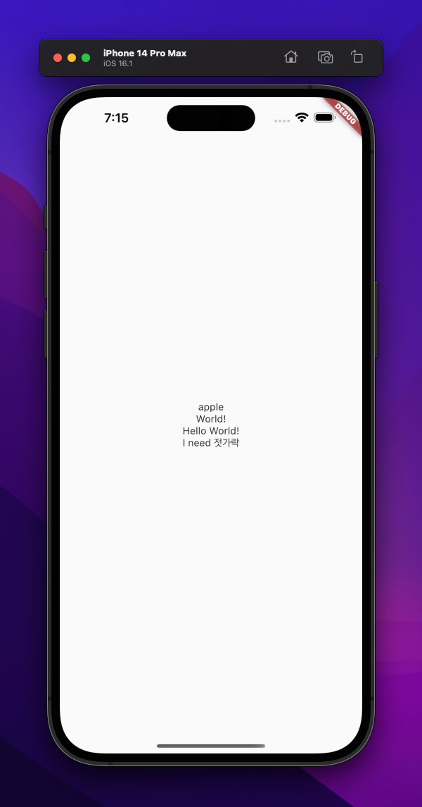

## 번역 파일
번역 파일은 assets/translations에 넣음. en-US, ko-KR과 같은 형식으로 넣음.<br>
"A" : { "B" : "C" } 라고 선언 했을 때, C를 출력하려면 "A.B".tr()로 호출.<br>
{}를 넣어서 선언해주면 해당 {}에 args 인자를 통해 값 넣어줄 수 잇음.<br>
=== "en-US 파일"

    ```json
    {
      "Apple" : "apple",
      "needs" : "I need {}",
      "example": {
        "hello": "Hello",
        "world": "World!",
        "helloWorld": "@:example.hello @:example.world"
      }
    }
    ```

=== "ko-KR 파일"

    ```json
    {
      "Apple" : "사과",
      "needs" : "나는 {}이 필요하다",
      "example": {
          "hello": "안녕",
          "world": " 세상아!",
          "helloWorld": "@:example.hello @:example.world"
        }
    }
    ```

## 사용법

### 선언
 
```dart title='main : Easy Localization Setting '
final supportedLocales = [
  const Locale('en', 'US'),
  const Locale('ko', 'KR'),
];

void main() async {
  WidgetsFlutterBinding.ensureInitialized();
  // easy localization 초기화
  await EasyLocalization.ensureInitialized(); 

  runApp(
    EasyLocalization(
        supportedLocales: supportedLocales,
        path: 'assets/translations', // 파일 위치 
        fallbackLocale: const Locale('en','US'), // 기본 locale
        child: const MyApp()),
  );
}
```

```dart title='Material App Setting'
class MyApp extends StatelessWidget {
  const MyApp({super.key});

  @override
  Widget build(BuildContext context) {
    return MaterialApp(
      supportedLocales: context.supportedLocales,
      locale: context.locale, // 현재 기기 로케일
      localizationsDelegates: context.localizationDelegates, 

      home: const HomeScreen(),
    );
  }
}
```

### HomeScreen()

```dart title="HomeScreen()"
class HomeScreen extends StatelessWidget {
  const HomeScreen({super.key});

  @override
  Widget build(BuildContext context) { // (1) 실행결과
    return Scaffold(
      body: Column(
        mainAxisAlignment: MainAxisAlignment.center,
        crossAxisAlignment: CrossAxisAlignment.stretch,
        children: [
          Text(
            'Apple'.tr(),
            textAlign: TextAlign.center,
          ),
          Text(
            'example.world'.tr(),
            textAlign: TextAlign.center,
          ),
          Text(
            // "A" : { "B" : "C" } C를 출력하려면 "A.B".tr()로 호출
            'example.helloWorld'.tr(),
            textAlign: TextAlign.center,
          ),
          Text(
            // {}를 넣어서 선언해주면 해당 {}에 args 인자를 통해 값 넣어줄 수 잇음
            'needs'.tr(args: ['젓가락']),
            textAlign: TextAlign.center,
          ),

        ],
      ),
    );
  }
}
```

1. 


